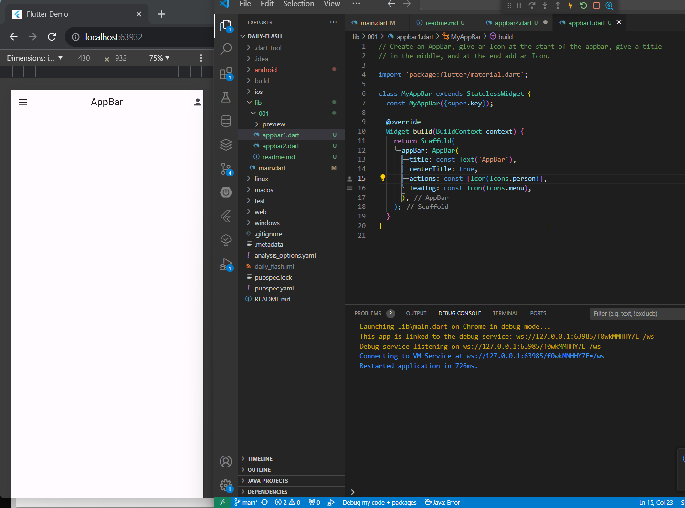
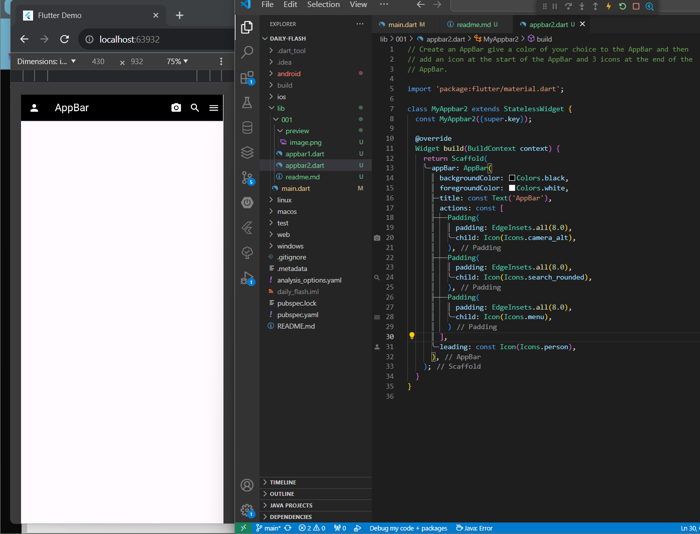
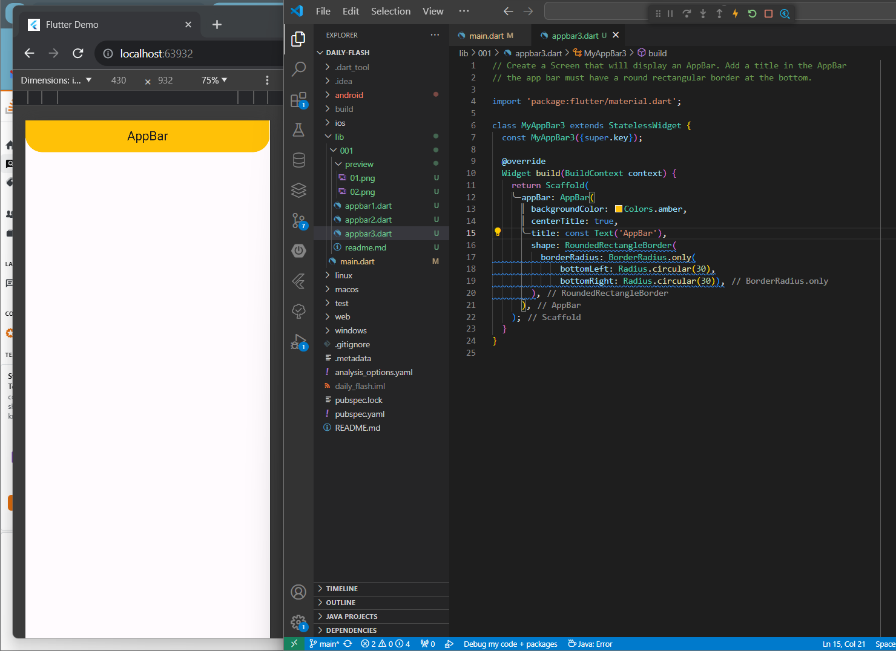
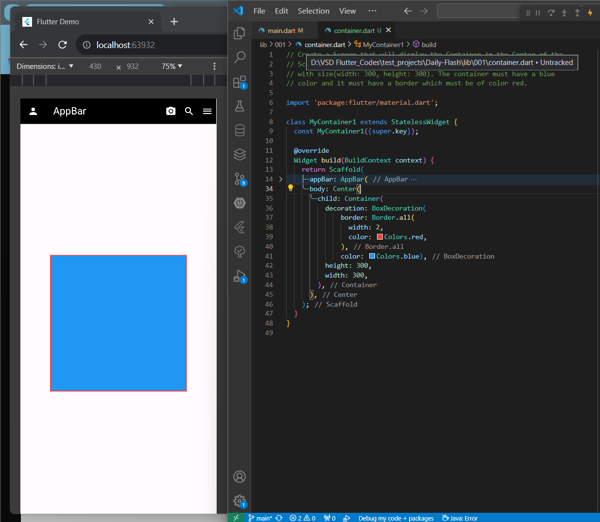
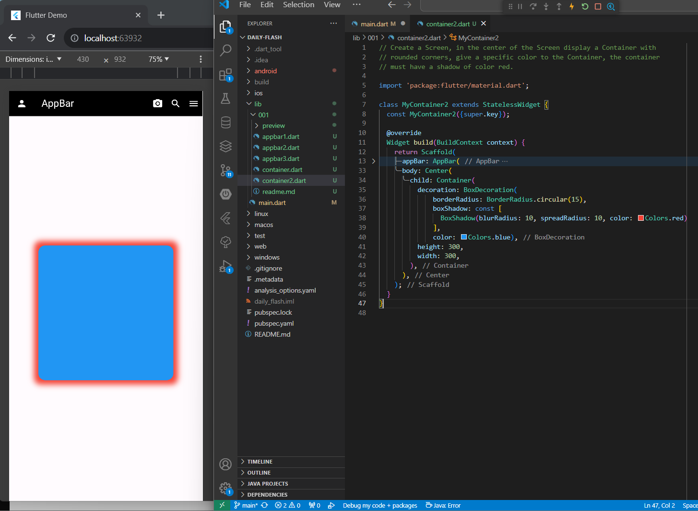

# Daily Flash 01

## 01 
Create an AppBar, give an Icon at the start of the appbar, give a title in the middle, and at the end add an Icon.

# 02
Create an AppBar give a color of your choice to the AppBar and then add an icon at the start of the AppBar and 3 icons at the end of the
AppBar.

# 03
Create a Screen that will display an AppBar. Add a title in the AppBar the app bar must have a round rectangular border at the bottom.

# 04
Create a Screen that will display the Container in the Center of the
Screen,
with size(width: 300, height: 300). The container must have a blue
color and it must have a border which must be of color red.

# 05
Create a Screen, in the center of the Screen display a Container withrounded corners, give a specific color to the Container, the containermust have a shadow of color red.

