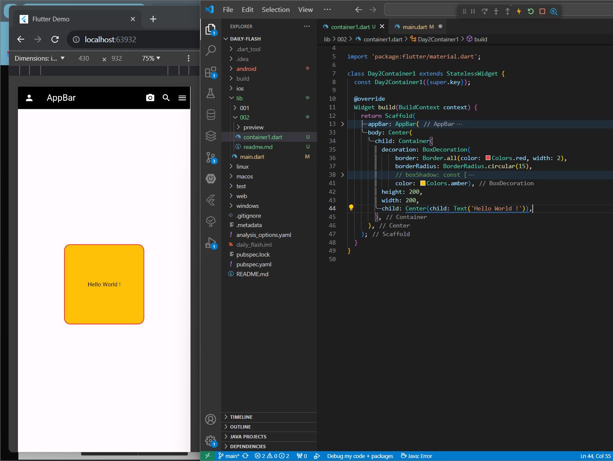
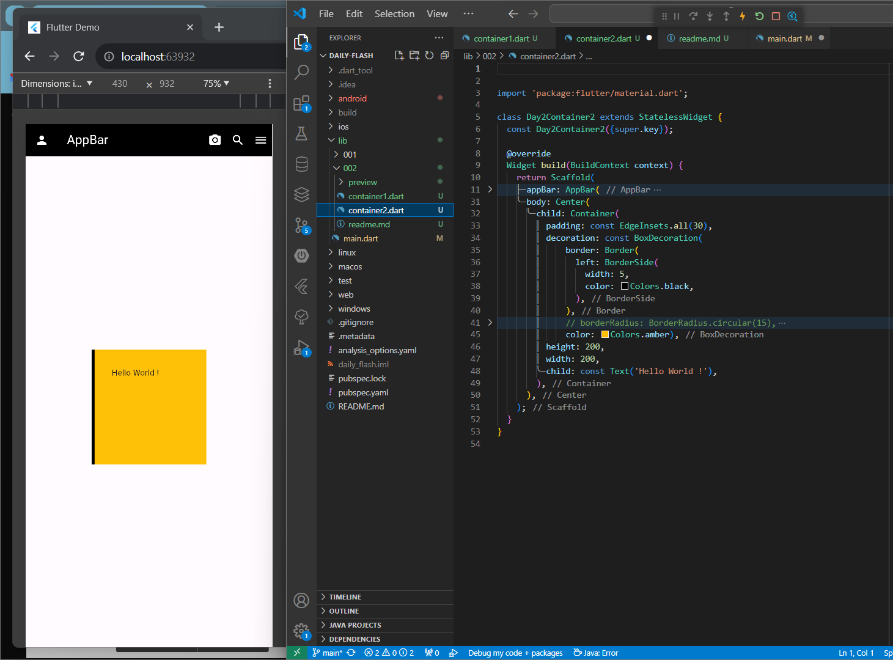
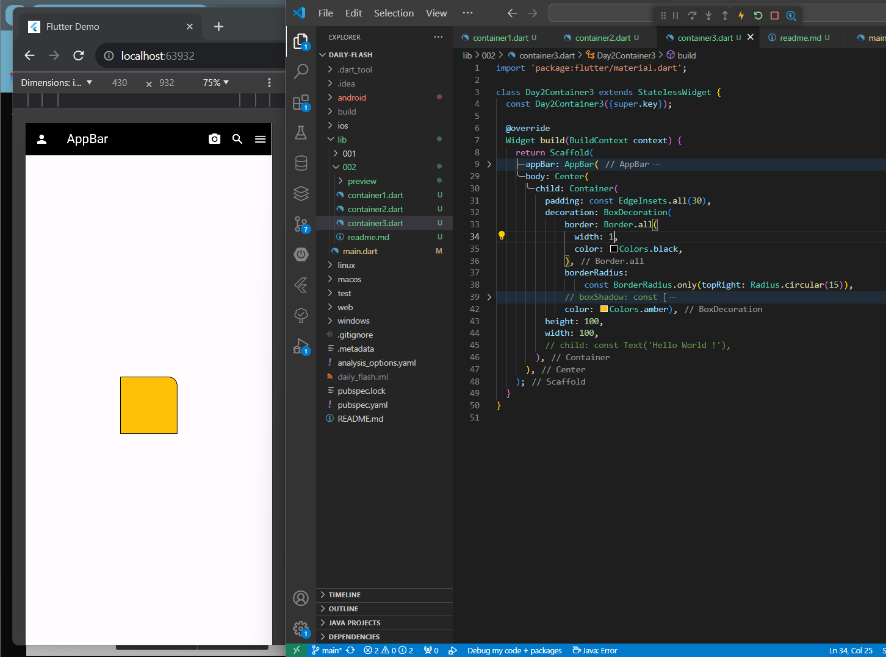
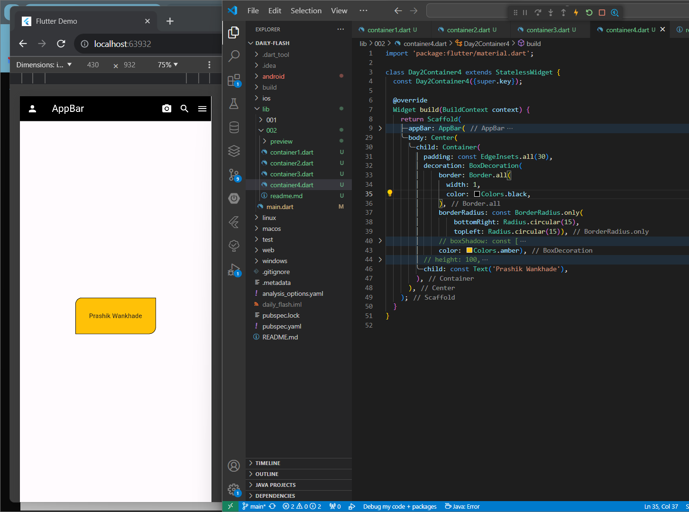
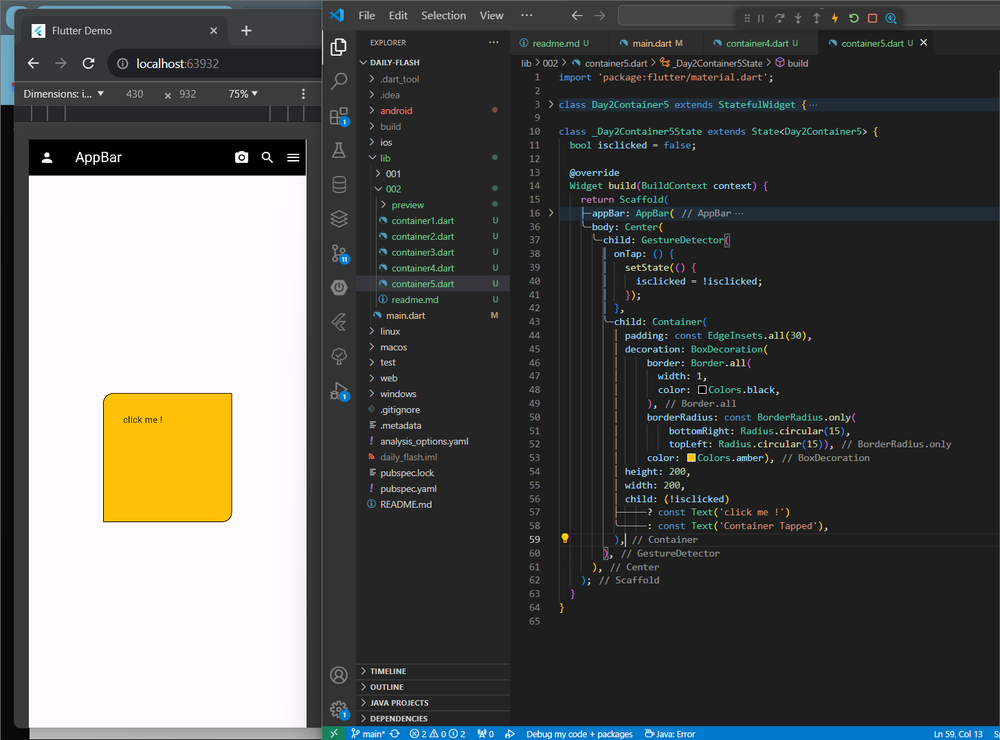

# Daily Flash 01

## 01 
Create a screen that displays the container in the center having size (height:200, width: 200). The Container must have border with rounded edges. The border must be of the color red. Display a Text in the center of the container.

# 02
In the screen add a container of size( width 100, height: 100) that must only have a left border of width 5 and color as per your choice. Give padding to the container and display a text in the Container.

# 03
In the screen add a container of size( width 100, height: 100) . The container must have a border as displayed in the below image. Give color to the container and border as per your choice.

# 04
Create a container that will have a border. The top right and bottom left corners of the border must be rounded. Now display the Text in the Container and give appropriate padding to the container.

# 05
Add a container with the color red and display the text "Click me!" in the center of the container. On tapping the container, the text must change to “Container Tapped” and the color of the container must change to blue.

