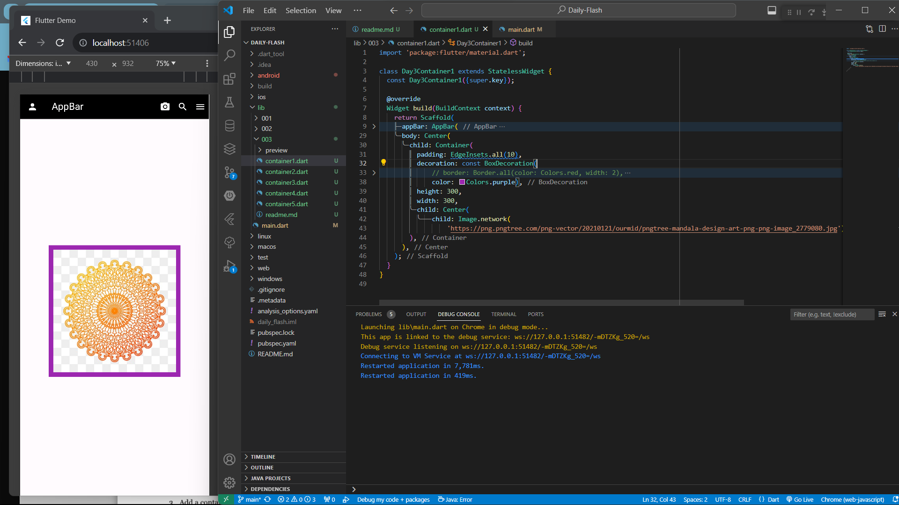
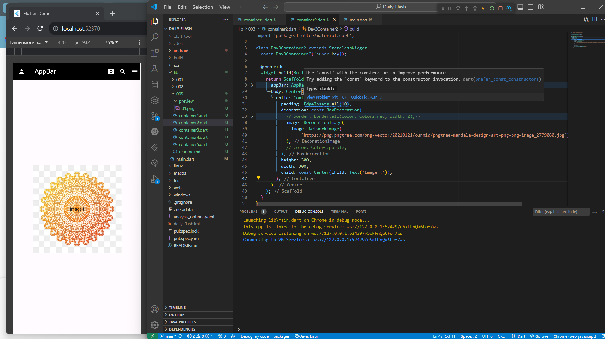
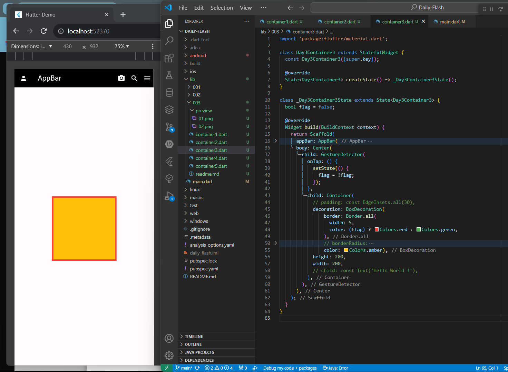
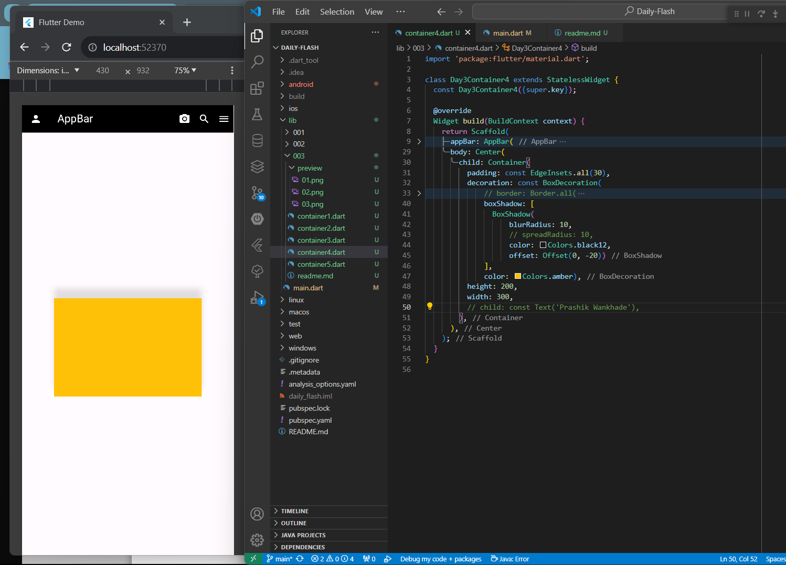
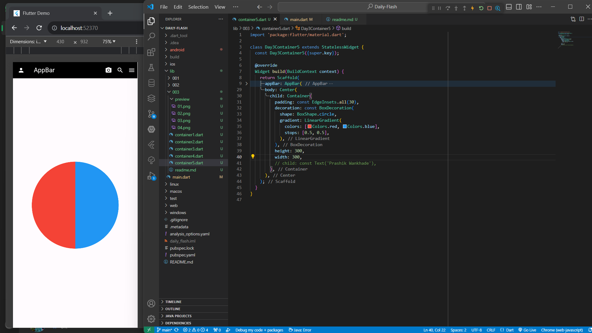

# Daily Flash 01

## 01 
Create a Container in the Center of the Screen with size(width: 300,
height: 300) and display an image in the center of the Container. Apply
appropriate padding to the container.

# 02
Create a Container in the Center of the screen, now In the background of
the Container display an Image (the image can be an asset or network
image ). Also, display text in the center of the Container.
(Refer to The below image the name “Core2web” is displayed in the
center of the container and the image is displayed in the background)

# 03
Add a container in the center of the screen with a size(width: 200,
height: 200). Give a red border to the container. Now when the user taps
the container change the color of the border to green.

# 04
Create a Container with size(height:200, width:300) now give a shadow to
the container but the shadow must only be at the top side of the container.

# 05
Create a Circular Container and give the Container 2 colors i.e. red and
blue. 50 % of the container must contain red and the other 50 % must
contain blue color.
(Note: The transition from the Red color to blue must be sharp)

