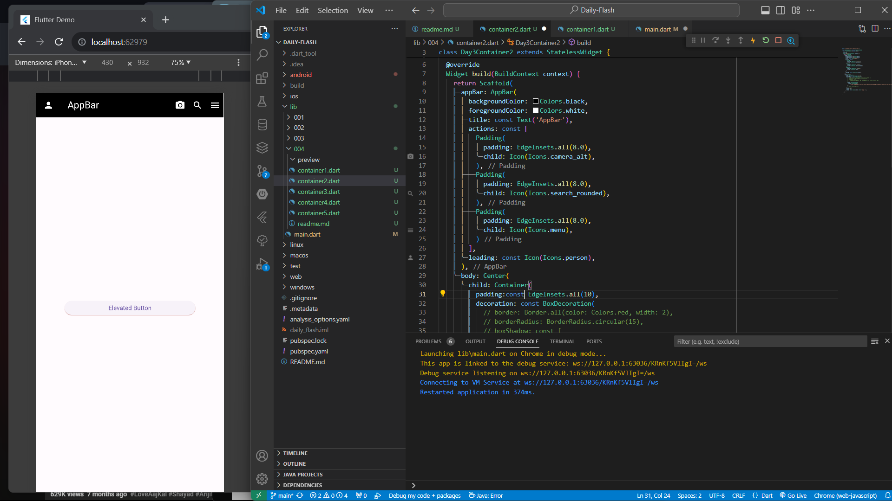
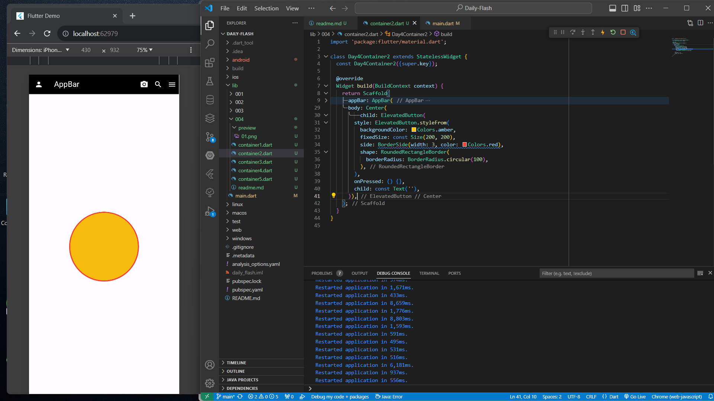
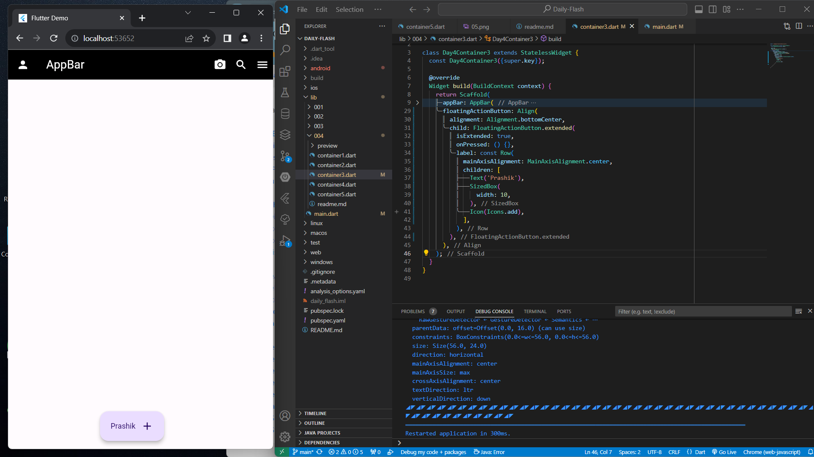
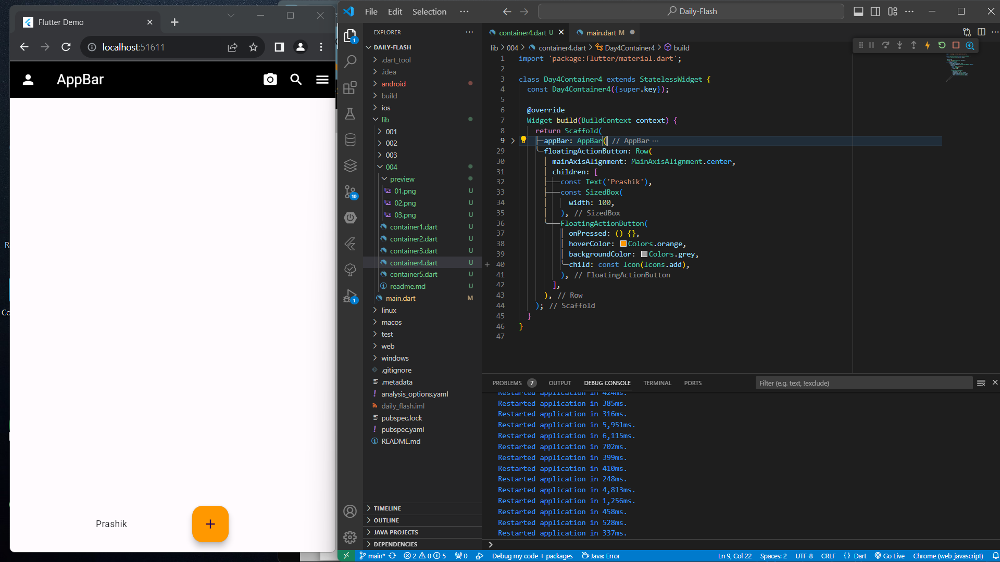
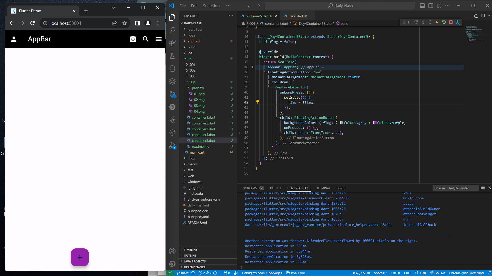

# Daily Flash 01

## 01 
Create an ElevatedButton, in the centre of the screen. The button must
have rounded edges. Give a shadow of color red to the button.

# 02
Create an Elevated button in the Center of the Screen. Decorate the button as
follows.
a. The button must be of Circular Shape.
b. The Size of the button must be (width:200, height: 200).
c. The button must have a border of color red.

# 03
Create a Screen and then add a floating action button. In this button, you
will have to display your name and an Icon which must be placed in a row.

# 04
Add a floating action button on the screen and when we hover over the
button the color of the button must become orange.

# 05
Create a screen and add a floatingAction button. Place the floating action
button in the bottom center of the screen. When the button is long pressed
the color of the button must change to purple.

