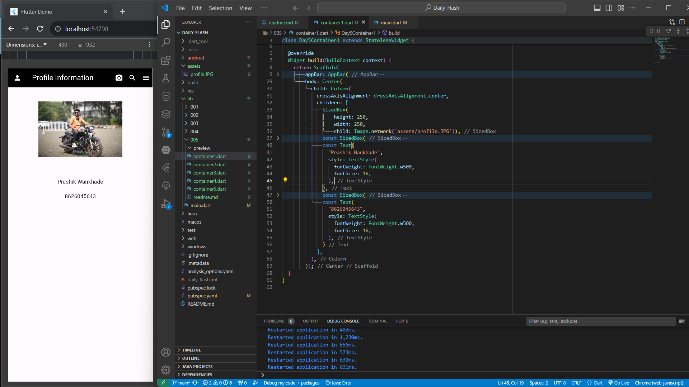
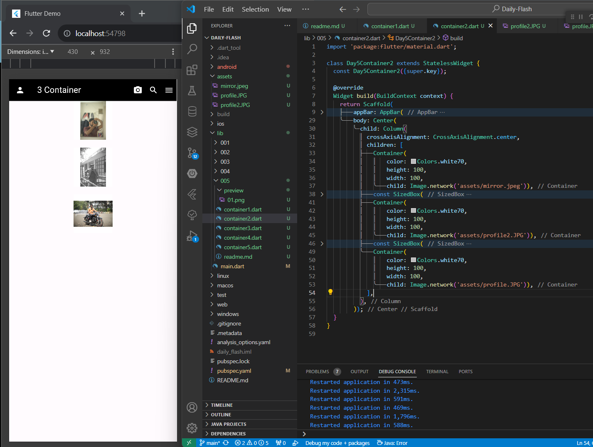
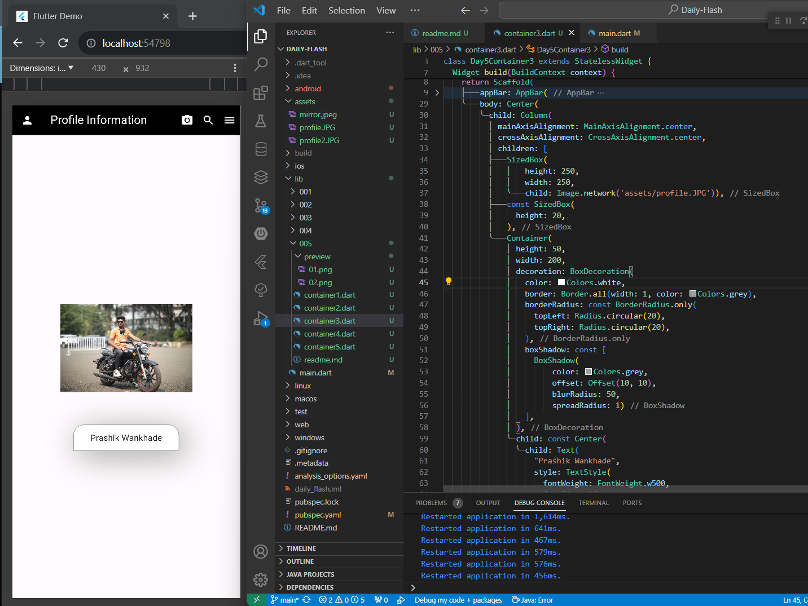
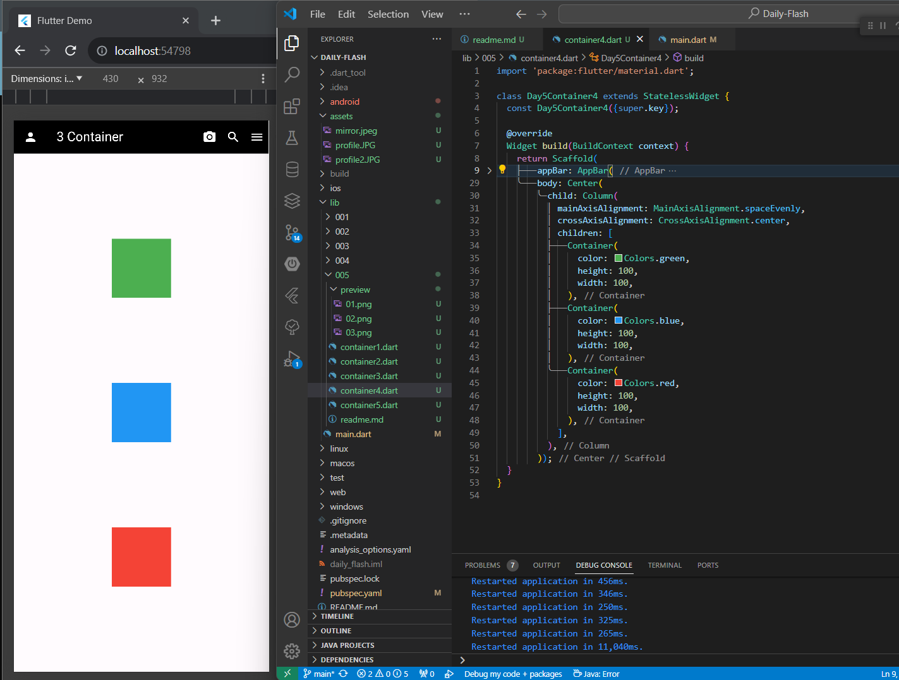
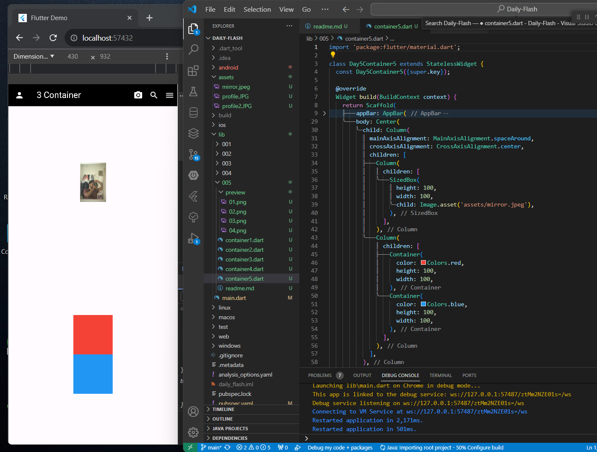

# Daily Flash 05

## 01 
Create a Screen, in the appBar display "Profile Information". In the body,
display an image of size (height: 250 width:250). Below the image add
appropriate spacing and then display the user Name and Phone Number
vertically. The name and phone number must have a font size of 16 and a font
weight of 500.

# 02
Create a Screen in which we have 3 Containers in a Column each container
must be of height 100 and width 100. Each container must have an image
as a child.

# 03
Create a Screen and add your image in the center of the screen below your
image display your name in a container, give a shadow to the Container
and give a border to the container the top left and top right corners must
be circular, with a radius of 20. Add appropriate padding to the container.

# 04
Create a Screen in which we will display 3 Containers of Size 100,100 in a
Row. Give color to the containers. The containers must divide the free
space in the main axis evenly among each other.

# 05
Create a Screen that displays 3 widgets in a Column. The image must be the
first widget, the next widget must be a Container of color red and the 3rd
widget must be a Container of color blue. Place all the 3 widgets in a
Column.
The Image must be placed at the top center and the other 2 widgets must
be placed at the bottom center of the screen.

